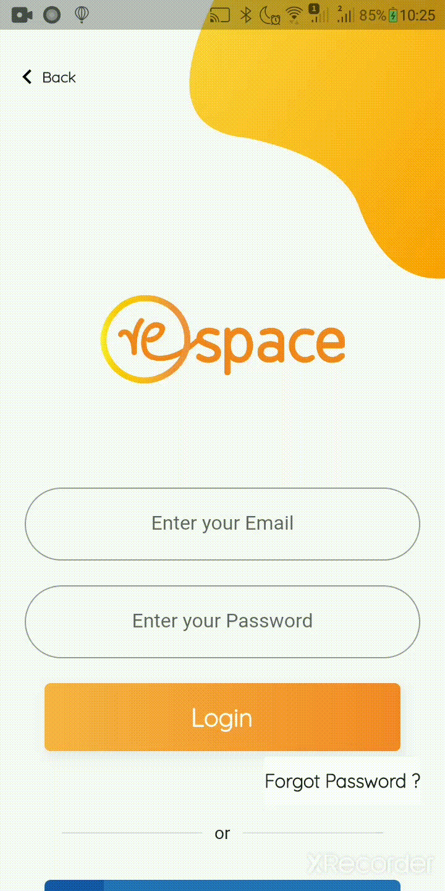

<h2 align="center">
  Connect your business with the retail world :earth_africa::iphone:
</h2>

  
  
   
  
   
  
  
  ~~~~
  
  

 

<h2>Motivation:</h2>

According to a study in the Economic Times, online sales in India accounted for only 1.6% of total retail sales. This shows that despite the boom in the Indian e-commerce market, Indians are heavily reliant on offline retail stores for their day-to-day needs. There is a need of a platform where the retailers and producers can come together, communicate with each other and establish a synchronized retail space. 

<h2>Description:</h2>

A user can choose to be either a retailer or a producer in the app. A retailer will be able to search for a producer based on various parameters like - name, location, business tag, reviews and ratings and can further connect with them to buy their products. Similarly a producer can connect to a retailer of his/her choice and can initiate the business. 

Respace focuses on creating a connection between small producers and retailers so that their products can tap into a wider audience which they were earlier incapable of reaching through online mediums, such as social media marketing or e-commerce sites.

<h2> Goals of this project: </h2>

* [x] To bring in maximum number of small producers on the app.
* [x] To build a full fledged profile of the producer which shows different products available with him, its reviews and ratings from fellow buyers, and other different features.
* [x] To provide the retailers as well as the producers a refined search on the basis of their search parameters - name, location, business tags, ratings and reviews.
* [x] To provide interactive map feature so that the users of the app can easily find out the other users which can be in the region of their business interest.
* [x] To create a messaging platform for the retailers and producers to connect on the app itself.

<h2> How to use Respace </h2>

* [x] Producers can register their account on Respace, login and update their business details like business name, owner name, profile photo etc.
* [x] They can set up their business profile with a listing of their various products and product details like price, availability and so on.
* [x] Retailers i.e. offline shop owners can log in to Respace and search for small businesses near them.
* [x] Retailers can then buy products from the small businesses and stock them in their shops to sell to customers.
* [x] In this way, small businesses can make their products reach more people and shop owners can help support and grow local producers :)

<h2> How Respace works: </h2>

  <h4 align="center">Login/Register Page</h4>
   
   
  <h4 align="center">User Details Page</h4>
   
   
  <h4 align="center">Profile Page and adding products</h4>
   
   
  <h4 align="center">Get business card</h4>
   
   
  <h4 align="center">Search for a business</h4>
  
   
   
  
 To see the complete working of the app, <a  href="https://youtu.be/3RcgCibxwWg">click here</a>. 

<h2> Future Scope of this project: </h2>

* [ ] Adding an option of collaborating with different producers (an additonal feature for producers).
* [ ] Adding different search filters.
* [ ] Connecting it efficiently with Firebase and fetching the correct results on a search.
* [ ] Connecting Respace with other social media handles.
* [ ] Adding a feature of rating and reviewing of different products. 
* [ ] Providing the facility of logistics. 
* [ ] Adding a safe and secure money transferring service on buying a product. 
  
<h2> To run the project:</h2>

* Set up [Android Studio](https://developer.android.com/studio?gclid=CjwKCAiAirb_BRBNEiwALHlnDz87uNVfYxk2n4MITdIyb8_Jc-Vxkju2mBJgvt1RVoTXKBpbL-oFmxoCrk8QAvD_BwE&gclsrc=aw.ds) or [Visual Studio Code](https://code.visualstudio.com/).
* Install [Flutter SDK](https://flutter.dev/docs/get-started/install). (Prerequisite: [Git](https://git-scm.com/downloads))
* Install [Dart SDK](https://dart.dev/get-dart). (Prerequisite: [Chocolatey](https://chocolatey.org/install))
* Install the flutter and dart plugins from the marketplace in the software you are working on. 
* Clone this project. Build and run the project and use the app on your emulator or phone.
 

This project is `our submission for the InOut 7.0 Hackathon.`

<h3 align="center"><b>Developed with :heart: by <a href="https://github.com/preetip26">Preeti Poddar</a> and <a href="https://github.com/TheEdelweissPirate">Varada Harikumar</a>.</b></h1>
